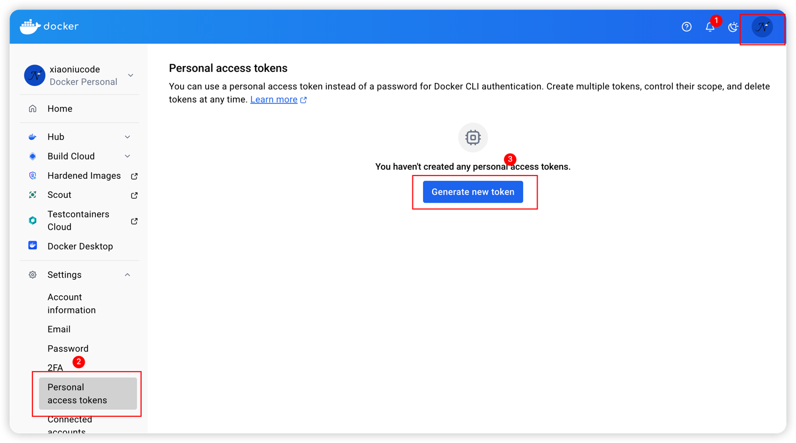
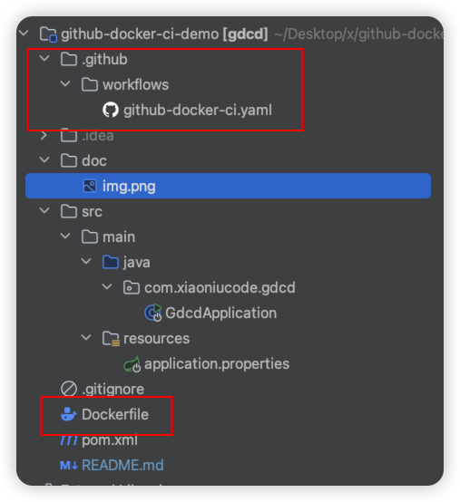
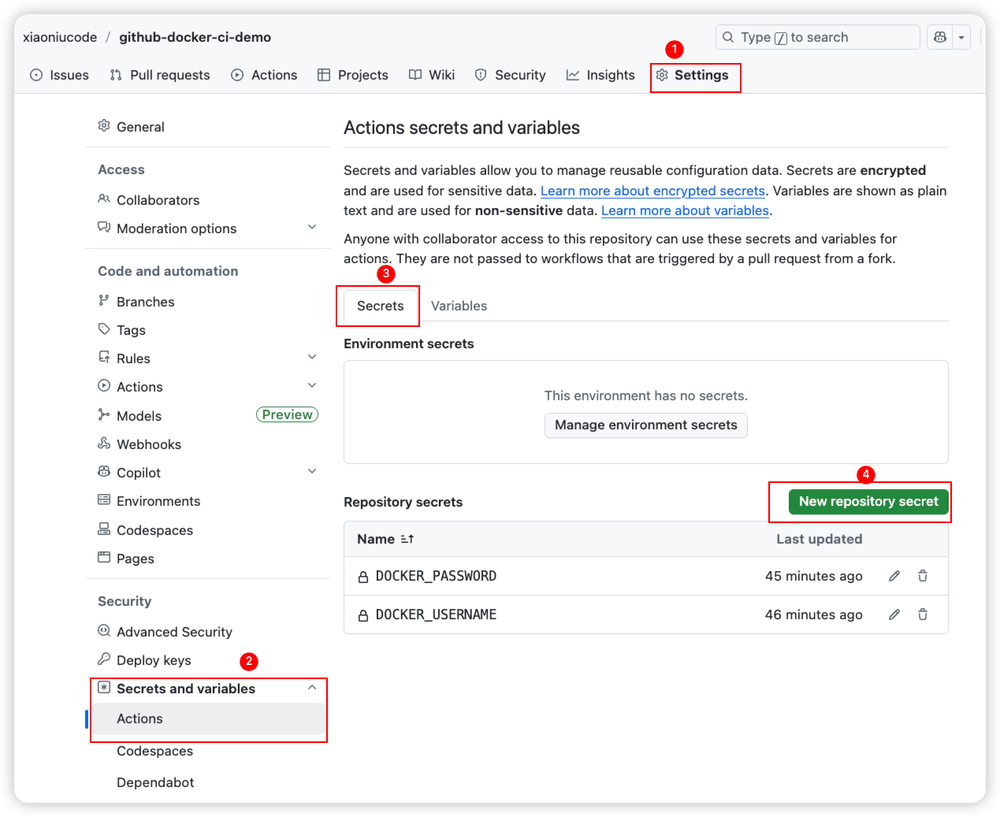
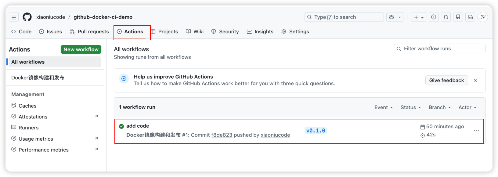
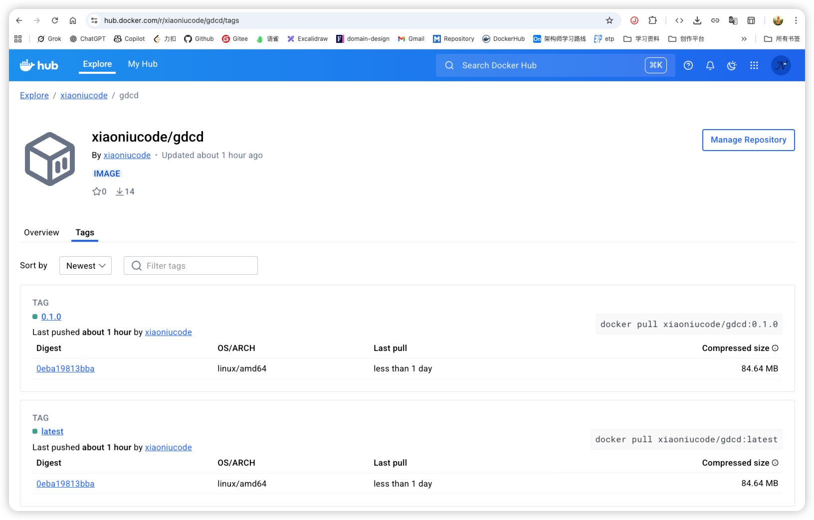

# 介绍

一个简易的GitHub Actions工作流。`push tag` 时自动打jar包，并构建docker镜像推送到docker-hub仓库。

## 教程

1、注册一个docker-hub账号

- https://app.docker.com/

2、生成access token用于docker hub登录认证



3、demo工程结构如下
工作流文件放到`.github/workflows/`目录里。



4、编写GitHub Actions workflows工作流文件

```yaml
name: Docker镜像构建和发布

on:
  push:
    tags:
      - 'v*'  # 只在推送标签时触发，比如 v0.1.0,v0.2.0 等
env:
  # docker 项目仓库，根据自己的填写
  DOCKER_REPOSITORY: 'xiaoniucode/gdcd'

jobs:
  build-and-push:
    runs-on: ubuntu-latest

    steps:
      # 1. 检出代码
      - uses: actions/checkout@v4

      # 2. 设置 Java 环境
      - name: 设置 JDK 8
        uses: actions/setup-java@v4
        with:
          java-version: '8'
          distribution: 'temurin'

      # 3. 构建JAR包
      - name: Maven打包jar
        run: mvn clean package -DskipTests

      # 4. 登录到 Docker Hub（私密信息使用 GitHub Secrets）
      - name: 登录到 Docker Hub
        run: |
          echo "登录到 Docker Hub..."
          echo "${{ secrets.DOCKER_PASSWORD }}" | docker login -u ${{ secrets.DOCKER_USERNAME }} --password-stdin

      # 5. 提取版本标签
      - name: 从tags中提取版本号
        id: version
        run: |
          # 从标签中提取版本号，如 v0.1.0
          VERSION="${GITHUB_REF#refs/tags/v}"
          echo "version=${VERSION}" >> $GITHUB_OUTPUT

      # 6. 构建和推送 Docker 镜像
      - name: 构建docker镜像并发布到docker hub公开仓库
        run: |
          # 提取版本号
          VERSION="${{ steps.version.outputs.version }}"

          echo "开始构建 Docker 镜像..."
          echo "版本号: $VERSION"
          echo "Docker 镜像: ${{ env.DOCKER_REPOSITORY }}"

          # 构建镜像
          docker build . \
            --file Dockerfile \
            --tag ${{ env.DOCKER_REPOSITORY }}:latest \
            --tag ${{ env.DOCKER_REPOSITORY }}:$VERSION

          # 推送镜像到 Docker Hub
          echo "推送镜像到 Docker Hub..."
          docker push ${{ env.DOCKER_REPOSITORY }}:latest
          docker push ${{ env.DOCKER_REPOSITORY }}:$VERSION

          echo "镜像已推送到 Docker Hub:"
          echo "   - ${{ env.DOCKER_REPOSITORY }}:latest"
          echo "   - ${{ env.DOCKER_REPOSITORY }}:$VERSION"

```

变量说明：

- DOCKER_REPOSITORY: <docker-hub用户名/镜像名>
- DOCKER_USERNAME：docker-hub用户名
- DOCKER_PASSWORD：docker-hub access-token

5、docker-hub中的access token等私密信息需要存储到GitHub中，通过` ${{ secrets.<Name> }}`引用。



6、编写Dockerfile文件

```properties
FROM eclipse-temurin:8-jdk-alpine
WORKDIR /app
COPY target/gdcd-0.1.0.jar app.jar
EXPOSE 8080
ENTRYPOINT ["java", "-jar", "app.jar"]
```

---

7、将上述所有新增内容提交到GitHub后，创建tag并推送。点击Actions查看工作流运行情况。



8、docker-hub查看结果



## 🪧

🔥🔥🔥项目推荐：https://github.com/xiaoniucode/etp
